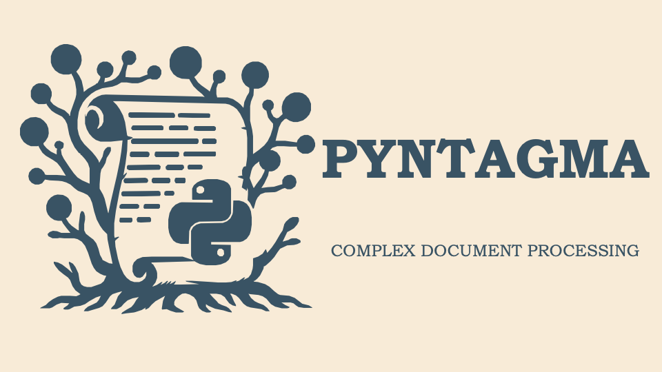

# Pyntagma

Welcome to the documentation for the `pyntagma` package!

Pyntagma aims to bring modern document-processing tools together into a single,
standardized, and convenient library. It lets practitioners and researchers
compose precise, testable rules to extract complex data from large archives.

## Features

- Structured PDF parsing with clear geometry
- Composable algebra on positions and regions
- Bidirectional navigation (lines ⇄ words ⇄ chars)
- Quiet, predictable PDF I/O (pdfplumber)
- Multimodal AI integration for crop-aware prompts

Get started with the Overview, then see Concepts for details on the difference
between algebra and bidirectional navigation, and AI Tools for model-assisted
workflows.
